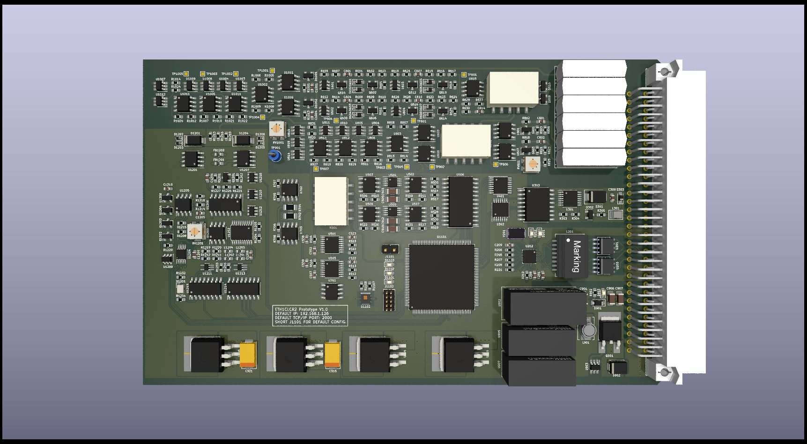
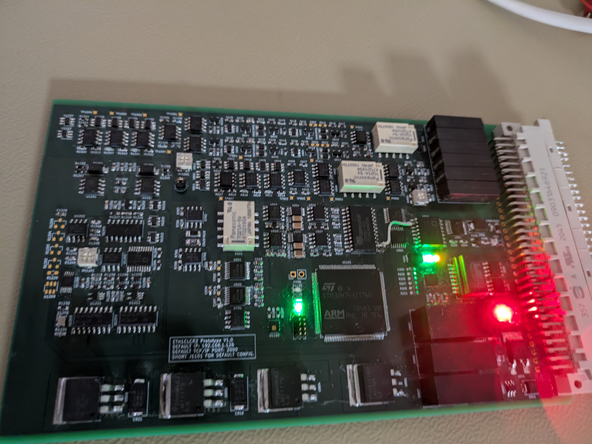

<h1>ETH1CLCR2</h1>
LCR measurement card with Ethernet interface.

<h2>PCB Design</h2>

3D model rendition for PCB V1.0.

</img>

Below are the images for the PCB V1.0. Mistake solved with batch wire.

</img>

</img>

</img>

<h2>Tests</h2>
Some test measurements perform on passive components. 

>[!NOTE]
>The components where measured directly, not in a circuit. The cards was not calibrated.

<table align="center">
    <tr>
        <th>Type</th>
        <th>Component</th>
        <th>Value</th>
        <th>Component Tolerance</th>
        <th>Measurement</th>
    </tr>
    <tr>
        <td>Resistor</td>
        <td>WS21R000FEK</td>
        <td>2 Ω</td>
        <td>1%</td>
        <td>2.2352 Ω</td>
    </tr>
    <tr>
        <td>Resistor</td>
        <td>SR1206JR-7W3R3L</td>
        <td>3.3 Ω</td>
        <td>5%</td>
        <td>3.8283 Ω</td>
    </tr>
    <tr>
        <td>Resistor</td>
        <td>PTF5610K000AYEK</td>
        <td>10 kΩ</td>
        <td>0.05%</td>
        <td>10.01509 kΩ</td>
    </tr>
    <tr>
        <td>Resistor</td>
        <td>RN732BTTD9002B25</td>
        <td>90 kΩ</td>
        <td>0.1%</td>
        <td>90.02021 kΩ</td>
    </tr>
    <tr>
        <td>Resistor</td>
        <td>ERA-8VRB1003V</td>
        <td>100 kΩ</td>
        <td>0.1%</td>
        <td>100.294 kΩ</td>
    </tr>
    <tr>
        <td>Resistor</td>
        <td>HHV-50FR-52-10M</td>
        <td>10 MegΩ</td>
        <td>1%</td>
        <td>10.490122 MegΩ</td>
    </tr>
    <tr>
        <td>Inductor</td>
        <td>AISR-01-104J</td>
        <td>100 mH</td>
        <td>5%</td>
        <td>102.6 mH</td>
    </tr>
    <tr>
        <td>Capacitor</td>
        <td>KP1830310061</td>
        <td>10 nF</td>
        <td>1%</td>
        <td>10.07 nF</td>
    </tr>
    <tr>
        <td>Capacitor</td>
        <td>F461BC104F400A</td>
        <td>100 nF</td>
        <td>1%</td>
        <td>106 nF</td>
    </tr>
    <tr>
        <td>Capacitor</td>
        <td>C315C101F3G5TA</td>
        <td>0.1 nF</td>
        <td>1%</td>
        <td>0.1071 nF</td>
    </tr>
    <tr>
        <td>Capacitor</td>
        <td>D83W4010M01H</td>
        <td>10 uF</td>
        <td>3%</td>
        <td>10.152 uF</td>
    </tr>
    <tr>
        <td>Capacitor</td>
        <td>MPK1839510401</td>
        <td>1 uF</td>
        <td>1%</td>
        <td>1.0695 uF</td>
    </tr>
    <tr>
        <td>Capacitor</td>
        <td>EST108M063AM3AA</td>
        <td>1 mF</td>
        <td>20%</td>
        <td>1.1 mF</td>
    </tr>
    <tr>
        <td>Capacitor</td>
        <td>F463AG102F2K0A</td>
        <td>1 nF</td>
        <td>1%</td>
        <td>1.0459 nF</td>
    </tr>
    <tr>
        <td>Capacitor</td>
        <td>MKP1839310251</td>
        <td>10 nF</td>
        <td>1%</td>
        <td>10.0974 nF</td>
    </tr>
    <tr>
        <td>Capacitor</td>
        <td>MKP1837410011</td>
        <td>100 nF</td>
        <td>1%</td>
        <td>101.457 nF</td>
    </tr>
    <tr>
        <td>Capacitor</td>
        <td>23PS222</td>
        <td>2.2 nF</td>
        <td>5%</td>
        <td>2.2161 nF</td>
    </tr>
</table>

<h2>NOTES</h2>
The ETH1CLCR2 PCB works, but I don't recommend using this design. The design has mistakes and could be made simpler and better.

